__IHateToBudget is now archived. See [#26](https://github.com/bminusl/ihatetobudget/issues/26).__

---

<p align="center">
  <a href="https://github.com/bminusl/ihatetobudget/">
    
  </a>
</p>

<h1 align="center">IHateToBudget</h1>

<p align="center">
  
  
  
  
  
  
</p>

<p align="center">
  A self-hosted personal finance app for expense tracking, budgeting, and data export.
</p>

---

## v0.2 Consolidated README

This document merges the legacy IHateToBudget baseline and the evolved production-ready artifact into a single, organized reference. All original content is preserved and reformatted for clarity.

---

## Table of Contents

* [Overview](#overview)
* [Key Capabilities](#key-capabilities)
* [Architecture & Evolution](#architecture--evolution)
* [Screenshots](#screenshots)
* [Installation & Configuration](#installation--configuration)
  * [Docker Method](#docker-method)
  * [Local Pipenv Method](#local-pipenv-method)
* [Updating](#updating)
* [Verification & Quality Gate Audits](#verification--quality-gate-audits)
* [Developer Documentation](#developer-documentation)
* [Code Quality](#code-quality)
* [Testing](#testing)
* [Contributing](#contributing)
* [License](#license)

---

## Overview

IHateToBudget is a lightweight personal accounting platform designed for self-hosted use, particularly for small households or local deployments. It provides a structured ledger, category-based budgeting, receipt capture support, and exportable financial data.

> Note: The project was archived in December 2022. This README preserves the legacy baseline while also documenting the evolved production-capable outcome.

---

## Key Capabilities

### 1. Isolated Multi-Tenant Workspace Onboarding
Supports self-service user registration, session management, and data isolation so each user retains a separate transaction context.

### 2. Categorized Transaction Ledger & Document Capture
Log dated expenses with category, description, and amount metadata. Attach digital receipt files and store them securely via persistent volume mounts.

### 3. Real-Time Budgetary Allocation Dashboard
Create monthly spending limits per category and view live utilization statistics including *Spent Balance*, *Remaining Capital*, and *Percent Used*.

### 4. Security-Bound CSV Data Portability
Export authenticated, session-bound transactions into clean CSV files for external analytics.

### 5. Theme Accessibility Toggling
Includes a persistent Dark Mode implementation via browser local storage for improved readability.

---

## Architecture & Evolution

### Production Evolution Summary

The legacy baseline introduced technical debt from an EOL framework, 92 known CVE vulnerabilities, and limited deployment readiness.

The evolved artifact follows ISO/IEC 14764:2022 maintenance discipline and includes corrective, preventive, perfective, and adaptive change activity to harden the system and modernize its architecture.

### Evolution Matrix

| Feature Dimension | Legacy Baseline (v1.5.7) | Evolved Capabilities (v2.0.0) |
| :--- | :--- | :--- |
| **Multi-Tenancy** | Single-tenant layout; no dynamic onboarding. | Strict data isolation; self-service registration. |
| **Financial Planning** | Reactive ledger logging only. | Proactive category budget limits and alerts. |
| **Security Controls** | Hardcoded production secrets; 92 CVEs. | `django-environ`; 97% dependency CVE reduction. |
| **Data Portability** | No backup/export pipeline. | Authenticated streamed CSV export. |
| **UI/UX Ergonomics** | Bootstrap 4 flat layout. | Bootstrap 5.3 responsive design with Dark Mode. |

### System Technology Stack

* **Core Logic Engine:** Python 3.10+ / Django 4.2.11 LTS
* **Database:** SQLite via Django ORM
* **Frontend:** Bootstrap 5.3, vanilla JavaScript, Chart.js
* **DevOps:** Docker Desktop and Docker Compose
* **QA / Security:** pytest-django, coverage.py, bandit, safety, pre-commit

---

## Screenshots

### Dashboard & Home
**Main Dashboard** - View your financial overview at a glance.

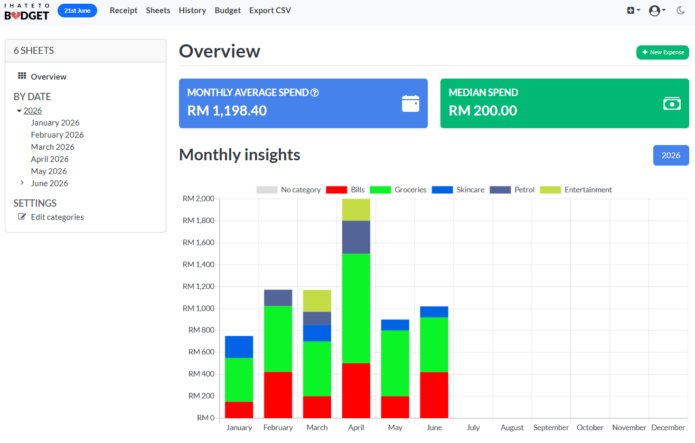

**Home (New Design)** - Clean home interface for quick access.

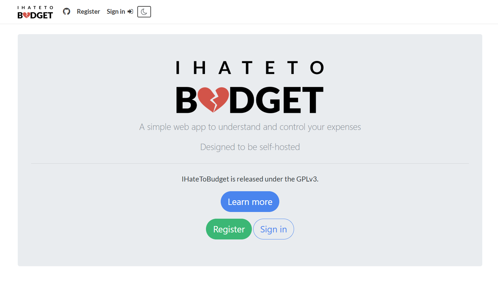

**Dashboard (New Design)** - Enhanced dashboard with improved layout.

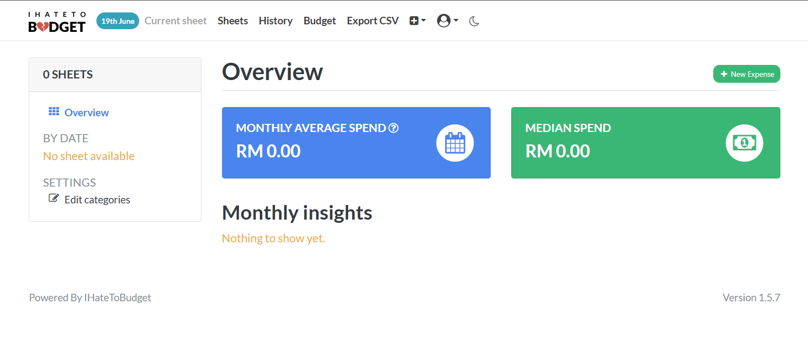

**Dashboard (Dark Mode)** - Dark mode support for reduced eye strain.

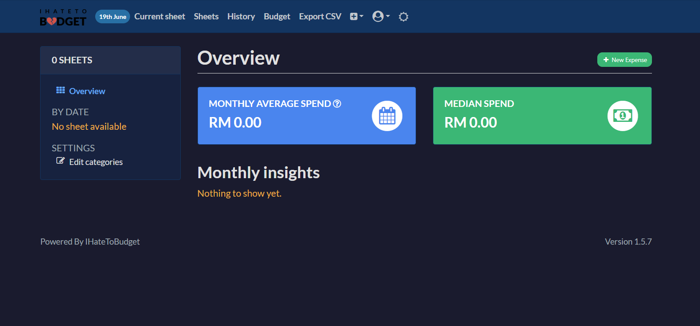

### Categories Management
**Categories** - Define categories and assign colors.


**Categories (Alternative View)** - View all categories in organized view.

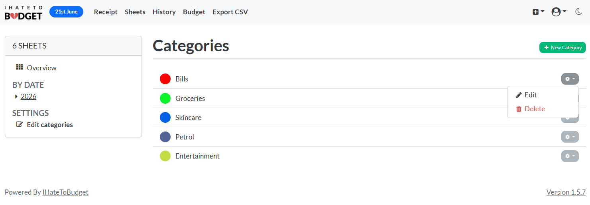

**Create New Category** - Add new expense categories easily.

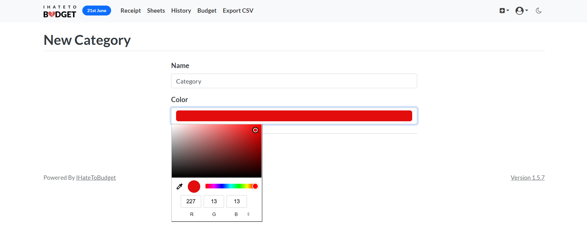

**Create New Category (New Design)** - Streamlined category creation interface.

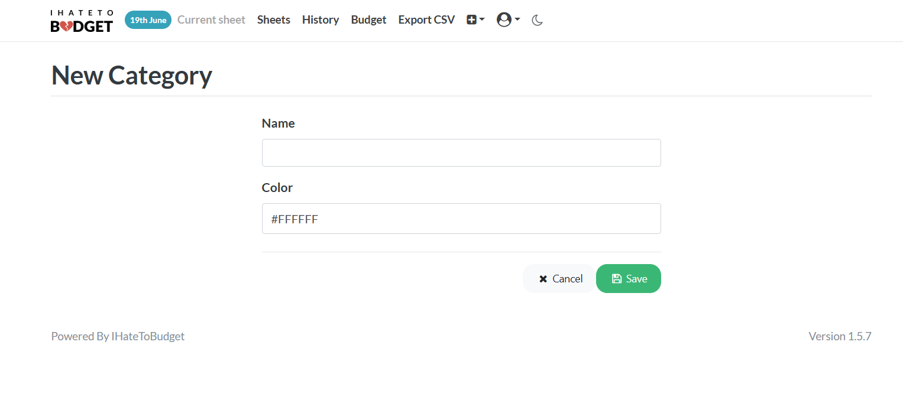

**Edit Category** - Modify existing category settings.

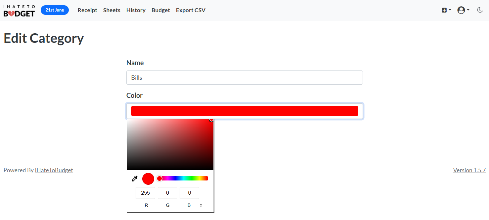

### Expense Management
**Sheet** - Add dated and categorized expenses that are automatically grouped by month.


**Create New Expense** - Easy interface to log new expenses.

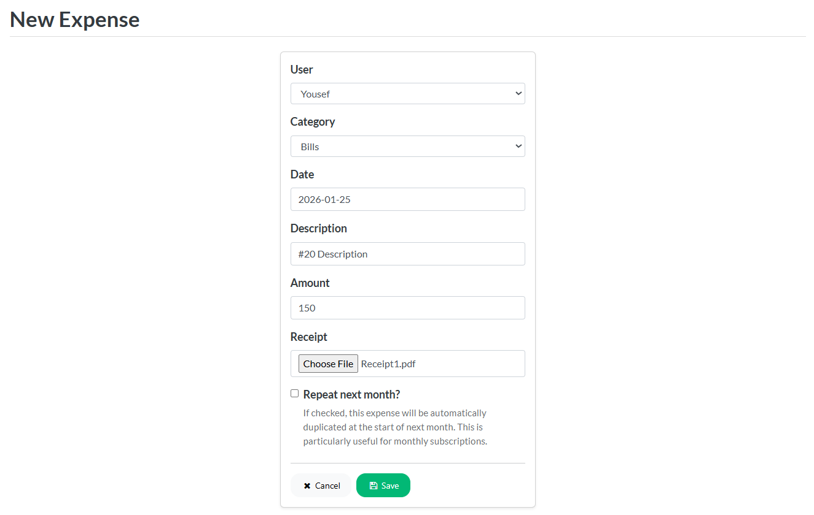

**Edit Expense** - Modify expense details and information.

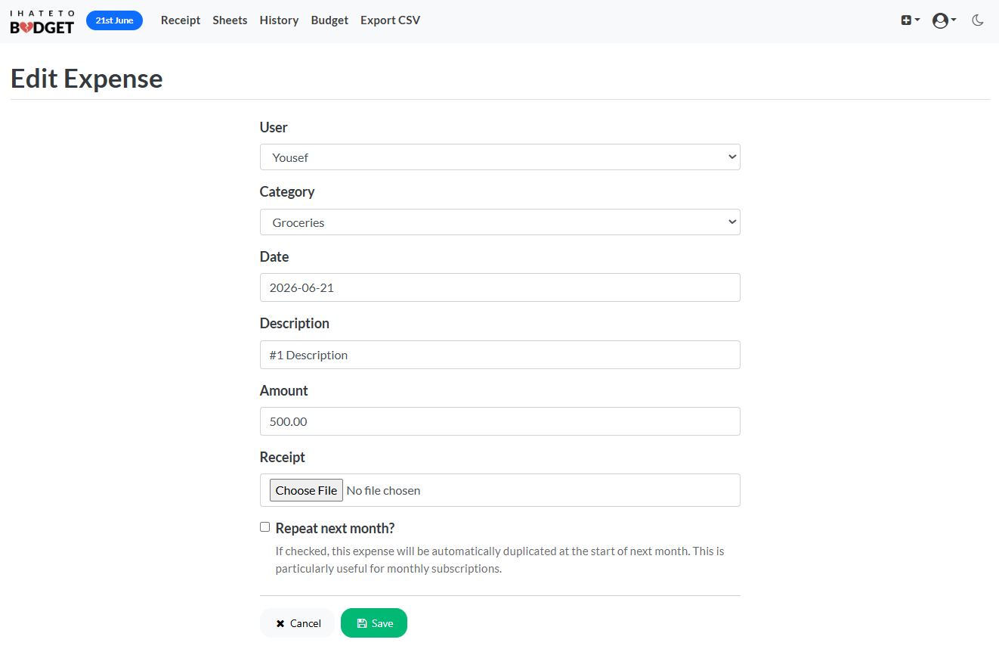

**Delete Confirmation** - Confirmation dialog for removing expenses.

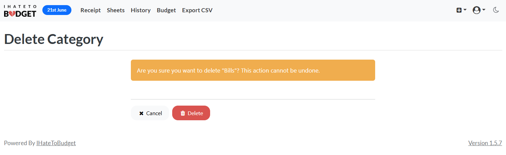

### Budget Management
**Budget Overview** - Set and track your budget limits.

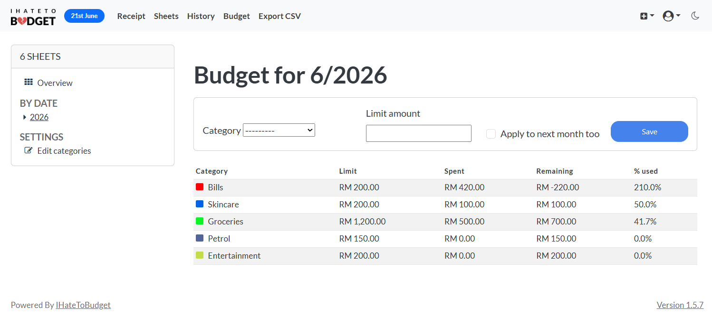

**Budget Line Chart** - Visualize budget spending trends.

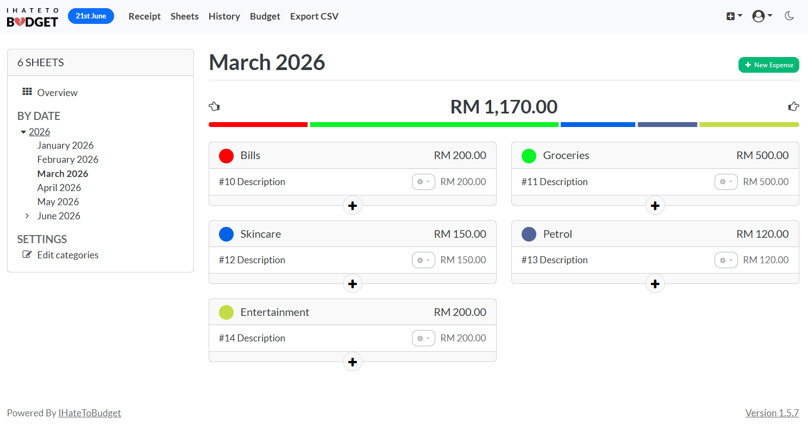

### Analytics & History
**Overview** - Analyze overall statistics and spending patterns.


**History** - Explore and filter all expense records.

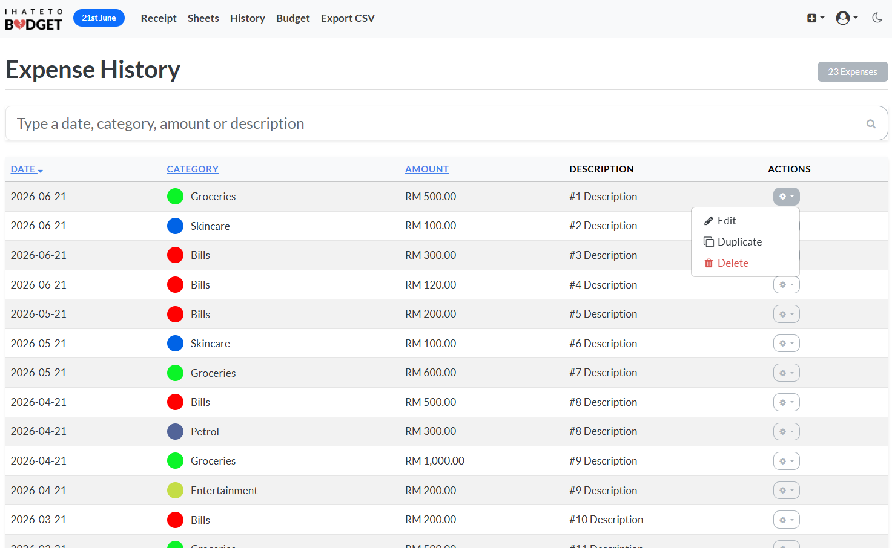

**Expense History (New Design)** - Enhanced expense history view with better filtering.

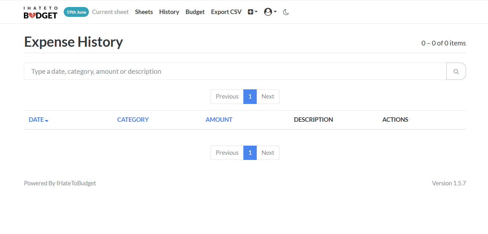

### Theme & Data
**Dark Mode** - Complete dark mode theme for comfortable viewing.

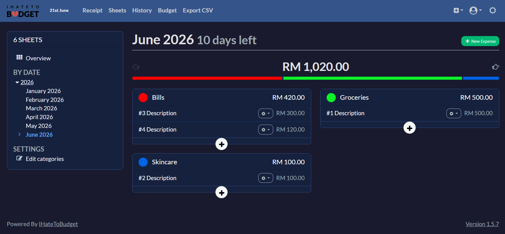

**Receipts** - Attach and manage digital receipt files for expenses.

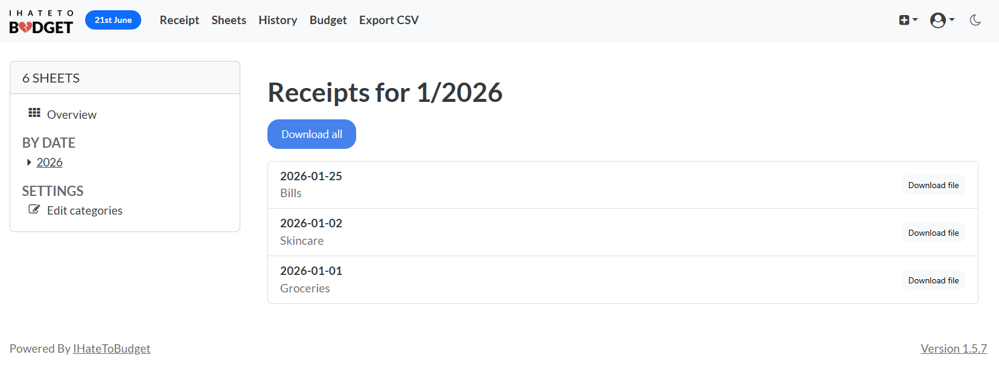

**CSV Export** - Export your financial data for external analysis.

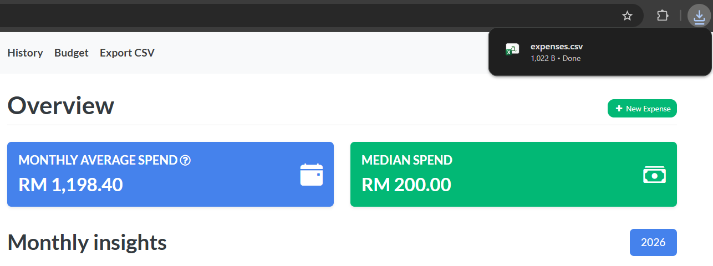

---

## Installation & Configuration

IHateToBudget can be deployed via Docker or run locally with Pipenv. Both methods are documented here.

### Docker Method

1. Install [Docker](https://www.docker.com/) and [docker-compose](https://docs.docker.com/compose/).

2. Clone the repository:

```bash
git clone https://github.com/bminusl/ihatetobudget.git
cd ihatetobudget
```

3. Create configuration copies:

```bash
cp docker-compose.yml.example docker-compose.yml
cp docker-compose.env.example docker-compose.env
cp Caddyfile.example Caddyfile
```

> Copying templates preserves the ability to update the repository cleanly.

4. Edit `docker-compose.env` and configure environment variables.

* `DJANGO_SECRET_KEY` — Django secret key.

See [Django SECRET_KEY](https://docs.djangoproject.com/en/3.1/ref/settings/#std:setting-SECRET_KEY).

#### Currency formatting

Money values are represented as `xxxxxxxx.yy`. Customize formatting using:

* `CURRENCY_GROUP_SEPARATOR`
* `CURRENCY_DECIMAL_SEPARATOR`
* `CURRENCY_PREFIX`
* `CURRENCY_SUFFIX`

Example for US dollars:

```bash
CURRENCY_GROUP_SEPARATOR=,
CURRENCY_DECIMAL_SEPARATOR=.
CURRENCY_PREFIX=$
CURRENCY_SUFFIX=
```

> Use non-breaking spaces if any variable contains spaces.

5. Start containers:

```bash
docker-compose up -d
```

6. Start cron in the container:

```bash
docker-compose exec ihatetobudget service cron start
```

7. Create a superuser and run migrations:

```bash
docker-compose run --rm ihatetobudget pipenv run python manage.py migrate
docker-compose run --rm ihatetobudget pipenv run python manage.py createsuperuser
```

8. Visit the application at `http://127.0.0.1:80`.

---

### Local Pipenv Method

1. Install Python 3.10+ and Pipenv.

2. Install dependencies:

```bash
pipenv install --dev
```

3. Enter the shell:

```bash
pipenv shell
```

4. Apply migrations:

```bash
python manage.py migrate
```

5. Run the development server:

```bash
python manage.py runserver
```

---

## Updating

### Docker method

1. Navigate to repository root.

2. Stop containers and remove volumes:

```bash
docker-compose down -v
```

> Removing volumes also clears container-managed storage.

3. Backup the database:

```bash
cp db.sqlite3 db.sqlite3.bak
```

4. Update the code:

```bash
git pull
```

5. Rebuild image:

```bash
docker-compose build
```

6. Migrate database:

```bash
docker-compose run --rm ihatetobudget pipenv run python manage.py migrate
```

7. Start containers:

```bash
docker-compose up -d
```

8. Restart cron:

```bash
docker-compose exec ihatetobudget service cron start
```

---

## Verification & Quality Gate Audits

### Deployment integrity check

```bash
python manage.py check --deploy
```

Expected output: `System check identified no issues (0 silenced)`.

### Regression test suite

```bash
pytest --cov=sheets --cov-report=term-missing
```

---

## Developer Documentation

This project is primarily a Django application.

### Development environment

1. Install [Pipenv](https://pypi.org/project/pipenv/).
2. Install dependencies:

```bash
pipenv install --dev
```

> The legacy baseline referenced Python 3.8, while evolved documentation references Python 3.10+.

### Starting development

```bash
pipenv shell
```

Run Django commands from the shell as needed.

---

## Code Quality

Pre-commit hooks maintain code consistency using:

* `black`
* `flake8`
* `isort`

Run:

```bash
pre-commit run --all-files
```

---

## Testing

Run tests:

```bash
python manage.py test
```

Measure coverage:

```bash
coverage run --source='.' manage.py test
```

---

## Contributing

The project is maintained primarily for personal use. Contributions are welcome as issues or pull requests.

Review developer documentation and follow branch naming and verification guidance when submitting changes.

Contributions must follow a strict, risk-mitigated workflow to maintain code quality. Please review our formal [Contributing Manual](https://www.google.com/search?q=CONTRIBUTING.md) to understand branch naming conventions (`feat/adaptive-`, `fix/corrective-`), mandatory pre-commit hooks integration (`bandit`, `safety`, `flake8`, `black`), and pull request verification expectations.

---

## License

The legacy repository is distributed under the GPLv3 License. See `COPYING` for full details.

The evolved artifact references the MIT License in the header.


---

## Maintenance Team

* **Mohammed Yousef Mohammed ABDULKAREM** (ID: 1221305727)
* **Mohammed AAMENA Mohammed Abdulkarem** (ID: 1221305728)  
* **FARAH HANIM BINTI MOHD ZAMRI** (ID: 1221305625) 
---

*Developed for CSE6364 Software Evolution & Maintenance under the supervision of Dr. Dr. Zuriani Hayati Binti Abdullah at Multimedia University.*

